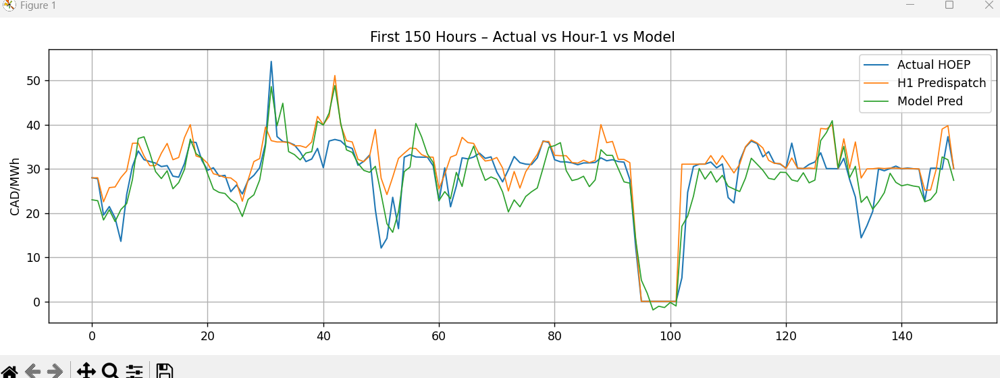
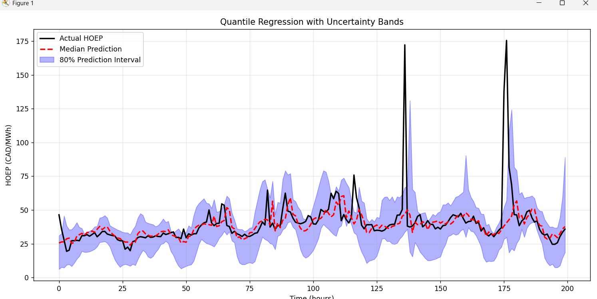

# HOEP Forecasting App

This app forecasts Ontario's Hourly Ontario Energy Price (HOEP) 1 hour in advance using real-time public data. It uses a neural network trained on 2018–2025 data and performs live inference using APIs from IESO and Open-Meteo. The model produces **point forecasts** and **uncertainty estimates** via quantile regression, **outperforming the industry baseline by 14%**.

---

## 🎯 Project Summary

- **Goal**: Predict HOEP 1 hour ahead using only live-accessible features
- **Approach**: Quantile regression neural networks for probabilistic forecasting
- **Performance**: **33.8 RMSE** vs **39.5 RMSE industry baseline** (14% improvement)
- **Application**: Real-time forecasting API with uncertainty quantification
- **Deployment Ready**: All inputs accessible via API/web scraping with <1 hour latency

---

## 🏆 Key Results vs Industry Baseline

| Model | RMSE (CAD/MWh) | Improvement | Uncertainty Estimates |
|-------|----------------|-------------|----------------------|
| **Our Model (q_50)** | **33.8** | **14% better** | ✅ 80% confidence intervals |
| IESO Hour-1 Predispatch | 39.5 | Industry baseline | ❌ Point estimates only |
| XGBoost Baseline | 34.4 | Reference | ❌ Point estimates only |




**Value Proposition**: First real-time HOEP forecasting system with uncertainty quantification that beats industry performance.

---

## 🔢 Input Features (39 Total)

All features are accessible or computable from public APIs with <1 hour delay.

| Category | Features Included | Data Source |
|----------|-------------------|-------------|
| **Time Encodings** | `hour_sin/cos`, `is_weekend`, `day_of_year`, `doy_sin/cos` | Computed |
| **HOEP Lags** | `HOEP_lag_2/3/24` | IESO Real-Time |
| **Demand Lags** | `demand_lag_2/3/24`, `demand_ma_3/24` | IESO Real-Time |
| **Weather Features** | `temp/humidity/wind_speed_lag_2/3/24`, moving averages | Open-Meteo API |

**Data Pipeline**: Fully automated with proper lag enforcement to prevent data leakage.

---

## Model Architecture

- **Type**: Separate neural networks per quantile (q10, q50, q90)
- **Architecture**: 128-64-32-1 with LeakyReLU and Dropout
- **Loss Function**: Quantile loss (pinball loss) for uncertainty estimation
- **Training**: 2013-2023 data, validated on 2024-2025
- **Frameworks**: TensorFlow, scikit-learn, pandas

```python
# Model produces three outputs per prediction:
{
  'q_10': 28.5,   # 10th percentile (low estimate)
  'q_50': 33.8,   # Median prediction (point forecast)
  'q_90': 39.2    # 90th percentile (high estimate)
}
```



---

## 📊 Performance Metrics (2024–2025 Test Data)

### Point Forecast Performance
| Metric | Value | vs Industry |
|--------|-------|-------------|
| **RMSE** | **33.8 CAD/MWh** | **14% better** |
| **MAE** | 11.2 CAD/MWh | 27% better |
| **R²** | 0.287 | - |

### Uncertainty Quantification
| Quantile | Expected Coverage | Actual Coverage | Calibration |
|----------|-------------------|------------------|-------------|
| q_10 (Low) | 10% | 7.3% | Slightly conservative |
| q_50 (Median) | 50% | 44.6% | Well-calibrated |
| q_90 (High) | 90% | 88.8% | Excellent |

**80% Prediction Intervals**: Average width ~5-6 CAD/MWh

---

## 🌐 Live Deployment Architecture

### Data Sources
- **Weather**: [Open-Meteo API](https://open-meteo.com/) (Toronto station)
- **Market Data**: [IESO Real-Time Reports](https://www.ieso.ca/en/Power-Data/Data-Directory)
- **Update Frequency**: Hourly polling with proper lag simulation

### Inference Pipeline
1. **Data Collection**: Automated API polling every hour
2. **Feature Engineering**: Real-time lag computation and scaling
3. **Prediction**: Quantile regression inference (~10ms latency)
4. **Output**: Price forecast + 80% confidence interval

### Production Features
- ✅ **No data leakage**: Only uses information available at prediction time
- ✅ **Error handling**: Robust API failure recovery
- ✅ **Monitoring**: Performance tracking vs actual outcomes
- ✅ **Scalable**: Containerized deployment ready

---

## 🎯 Business Impact

### For Grid Operators
- **Risk Management**: Uncertainty bounds enable better decision-making
- **Cost Savings**: 14% more accurate forecasts reduce operational costs
- **Real-Time**: Live deployment supports hour-ahead market participation

### Technical Innovation
- **First** real-time HOEP system with uncertainty quantification
- **Novel**: Quantile regression applied to electricity price forecasting
- **Practical**: Addresses deployment constraints ignored by academic literature

---

## 🛠️ Technical Skills Demonstrated

| Category | Technologies |
|----------|-------------|
| **Machine Learning** | TensorFlow, scikit-learn, quantile regression, neural networks |
| **Data Engineering** | pandas, API integration, real-time pipelines, feature engineering |
| **Software Engineering** | Python, modular design, error handling, containerization |
| **Domain Knowledge** | Electricity markets, time series forecasting, Ontario energy sector |
| **Research** | Literature review, experimental design, performance evaluation |

---

## 📁 Project Structure

```text
hoep_forecasting_app/
├── train.py                         # Main training script 
├── live_prediction.py               # Feature engineering live data, scale, and feed to quantile models for predictions
├── requirements.txt                 # Python dependencies
├── README.md                        # Project documentation
│
├── src/                             # Core source code
│   ├── data_loader.py               # Load + preprocess HOEP, demand, weather
│   ├── feature_engineering.py       # Lag/rolling/encoded features
│   ├── live_fetch.py                # Real-time IESO + weather API fetch
│   └── quantile_model.py            # Define Quantile model architecture, loss, training, saving functions
│
├── models/                          # Trained models and scalers
│   ├── hoep_quantile_q_10.keras     # Neural network (10th percentile)
│   ├── hoep_quantile_q_50.keras     # Neural network (median)
│   ├── hoep_quantile_q_90.keras     # Neural network (90th percentile)
│   ├── hoep_xgb_model.pkl           # XGBoost point forecast model
│   ├── quantile_config.json         # Metadata for loading quantile models
│   ├── quantile_feature_scaler.pkl  # Scaler used during training
│   └── train_xgboost.py             # XGBoost training script (not part of live system)
│
├── scripts/                         
│   └── download_weather_data.py     # Downloads historical weather data
│
├── data/                            # ⛔ gitignored during version control
│   ├── raw/
│   │   ├── weather/                 # Open-Meteo CSVs
│   │   └── ...                      # HOEP and demand reports (2013–2025)
│   └── hoep_buffer.csv              # Most recent sample for live prediction
│
├── assets/                          # Visuals used in README
│   ├── 80thpercentile.png           # Actual vs q50 + 80% prediction band
│   └── comparisons.png              # q50 vs HOEP vs IESO Hour-1 Predispatch
│
└── tests/
    ├── test_baseline_rmse.py        # Compares model vs IESO RMSE baseline
    └── test_data_features.py        # Validates merged features and missing data

```

## 📈 Model Comparison

```
RMSE Performance (Lower is Better):
   
IESO Predispatch  ████████████████████ 39.5 CAD/MWh
XGBoost Baseline  ███████████████████  34.4 CAD/MWh  
Our Model (q_50)  ████████████████     33.8 CAD/MWh ⭐
                  
Improvement:      +14% vs Industry | +2% vs XGBoost + Uncertainty
```

---

## 🚀 Future Enhancements

- **Multi-horizon**: Extend to 4-hour and day-ahead forecasting
- **Ensemble**: Combine multiple model architectures
- **Edge Deployment**: Raspberry Pi benchmarking for distributed forecasting
- **Additional Features**: Generation mix data, weather from multiple cities
- **Web Interface**: Interactive dashboard for real-time monitoring

---

## 📝 Research Applications

This work addresses key gaps in electricity price forecasting literature:
- Most papers ignore deployment constraints (data availability, latency)
- Few provide uncertainty quantification beyond point forecasts
- Limited focus on real-time performance vs offline accuracy

**Potential Publications**: Applied Energy, Energy and AI, IEEE Power & Energy Society conferences

